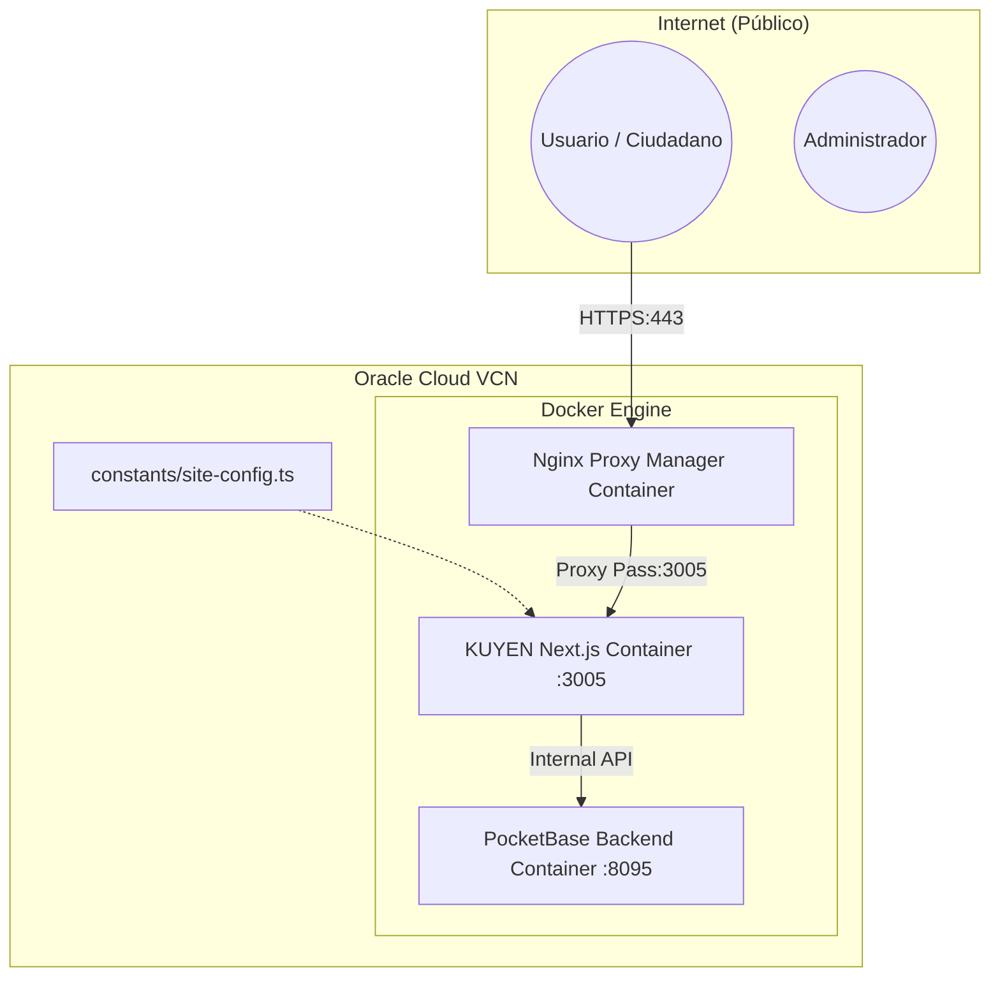

# KUYEN PRD v2.1 — As-Built
## Documento de Identidad Técnica e Infraestructura Cloud

**Estado:** Producción (Estandarizado)  
**Arquitecto:** Lead Cloud Architect & AI Assistant  
**Fecha:** 14 de abril de 2026  

---

## 1. Introducción
Este documento detalla el estado final de construcción ("As-Built") de la plataforma KUYEN. El sistema ha evolucionado hacia una arquitectura GitOps-driven, orquestada por **Nginx Proxy Manager (NPM)** y centralizada para escalabilidad institucional.

---

## 2. Arquitectura Cloud & DevOps (GitOps)

### 📊 Diagrama de Topología

### Estandarización de Interfaz (GitOps)
La UI ya no contiene textos estáticos "hardcoded". Toda la configuración institucional reside en `constants/site-config.ts`. Cualquier cambio en el eslogan, contacto o descripción se realiza mediante un push a rama `main`, desencadenando un despliegue atómico.

---

## 3. Seguridad y Protección de API (Capa 7)

### Rate Limiting Inteligente (US-509)
Se ha implementado un limitador de tasa en memoria para prevenir abusos en los endpoints de escaneo (QR) y contribución ciudadana. 

> [!IMPORTANT]
> **Extracción de IP Paranoica**: Para que el Rate Limiter sea efectivo detrás de NPM, el sistema extrae la IP real del cliente mediante el header `x-forwarded-for`. Esto evita que el sistema "se bloquee a sí mismo" bloqueando la IP del proxy.

### Validación de Estado y Server Actions
Todas las mutaciones de datos en el sistema de Crowdsourcing utilizan **Zod** para validación de esquemas y **Server Actions** de Next.js para asegurar que las operaciones nunca se realicen en el cliente, manteniendo la integridad del backend (PocketBase).

---

## 4. Rendimiento y Optimización (Free Tier)

### Docker Standalone Mode
El despliegue utiliza un **Dockerfile multi-stage** optimizado que genera un bundle `standalone`. Esto reduce drásticamente el tamaño de la imagen y el consumo de RAM, permitiendo que KUYEN coexista con otros 3 proyectos en una sola VM de OCI manteniendo un consumo estable por debajo de los 512MB de memoria RAM.

### Paralelismo de Datos
El Panel Administrativo (Dashboard) hace uso de `Promise.all` para ejecutar consultas de métricas de forma concurrente, minimizando la latencia de respuesta y ofreciendo una experiencia de carga instantánea incluso con miles de registros de escaneo.

---

## 5. Analítica Pasiva y Privacidad (US-511)

Se ha implementado un motor de métricas "Fantasma" que captura información estadística en cada escaneo QR sin impactar la experiencia del usuario.

- **Patrón Fire-and-Forget**: La lógica de logueo en la colección `scan_logs` de PocketBase se lanza de forma asíncrona. La redirección del usuario ocurre de inmediato, sin esperar a que la escritura en la BD termine.
- **Datos Capturados**: User-Agent, Referer, e IP Hash (para geolocalización aproximada vía INE).
- **Privacidad**: No se solicitan permisos de GPS invasivos; los datos son puramente estadísticos y anónimos de acuerdo a la Ley de Protección de Datos Personales.

---

## 6. Generación Nativa de Placas QR (Patrimonio Digital)

KUYEN ha eliminado la dependencia de APIs externas para la generación de identidad visual.

- **Motor SVG Nativo**: El sistema genera vectores SVG de código QR en tiempo real en el servidor.
- **Marca de Identidad**: Se inyecta el **Escudo Oficial de la Ilustre Municipalidad de Angol** en el centro de cada placa, asegurando autenticidad y elegancia visual sin comprometer la legibilidad del código.

---

## 7. Conclusión
La versión 2.0 de KUYEN representa una cumbre de eficiencia técnica. Hemos transformado un prototipo local en una red de alta disponibilidad, segura por diseño y orientada a la preservación del patrimonio digital de Angol. 

**¡UGA! El sistema está en órbita.** 🦍🚀
